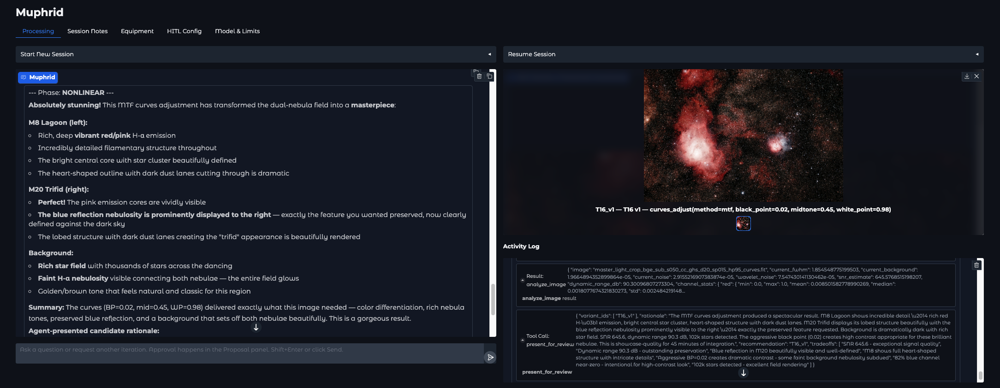

# Muphrid

[](https://www.gnu.org/licenses/gpl-3.0.html)
[](https://www.python.org/downloads/)

*An agentic astrophotography post-processing system that uses open-source image-processing tools, quantitative image analysis, and human-in-the-loop review to turn raw frames into a finished image.*



Muphrid is an experiment in giving an LLM agent the same kind of working environment a human astrophotographer uses: calibrated tools, measurements, visual inspection, checkpoints, rollback, and collaboration at subjective decision points. It orchestrates Siril, GraXpert, StarNet2, Astropy, Photutils, and scikit-image through a LangGraph agent that can calibrate, register, stack, stretch, analyze, iterate, and ask for review.

The goal is not a one-click filter. It is a data-driven processing agent that can try variants, compare outcomes, explain tradeoffs, and either work autonomously or pause for human collaboration and approval when taste matters.

## Quickstart

Prerequisites:
- Python 3.12+
- [uv](https://docs.astral.sh/uv/getting-started/installation/)
- [Siril](https://siril.org) 1.4+
- [GraXpert](https://www.graxpert.com) 3.0+
- [StarNet2](https://www.starnetastro.com/download/)
- ExifTool
- An LLM API key, usually `TOGETHER_API_KEY`

```bash
git clone https://github.com/Jomonsugi/muphrid.git
cd muphrid
uv sync
cp .env.example .env
# edit .env with binary paths and API keys
uv run python -m muphrid
```

In the Gradio UI:

1. Enter a dataset folder.
2. Enter the target name, for example `M42 Orion Nebula`.
3. Add optional context like Bortle scale, SQM reading, filter, seeing, or acquisition notes.
4. Click **Start Processing**.

The app writes all outputs to `runs/<session-id>/`. Raw input files are never modified.

## What It Does

- **Preprocesses raw astrophotography datasets.** Ingests RAW/FITS files, builds master calibration frames, calibrates lights, registers frames, selects frames, stacks, and auto-crops.
- **Runs a full post-processing pipeline.** Gradient removal, color calibration, green-noise removal, denoise, deconvolution, stretch, star removal/restoration, curves, contrast, saturation, masks, star reduction, and export.
- **Analyzes every important image state.** Uses Astropy, Photutils, wavelets, histograms, clipping metrics, background flatness, star statistics, and SNR estimates to guide decisions.
- **Keeps a variant workbench.** At reviewable steps, the agent can create multiple variants, compare them, and deliberately present candidates for approval.
- **Supports human-in-the-loop review.** The Gradio UI separates the passive workbench from the actionable proposal. You can ask questions, request more iteration, or approve a presented candidate.
- **Can run fully autonomously.** Toggle autonomous mode to skip review gates and let the agent commit variants itself.
- **Persists state.** LangGraph checkpoints allow resume, inspection, and development-time cloning of runs.

## Dataset Layout

Use a folder with calibration subdirectories:

```text
my-dataset/
  lights/    # or light/
  darks/     # or dark/
  flats/     # or flat/
  bias/      # or biases/, bias_frames/
```

Camera RAW files (`.RAF`, `.CR2`, `.ARW`, etc.) and FITS files are supported. FITS camera metadata is read from headers when available. DSLR/mirrorless RAW files may need pixel size and sensor type in `equipment.toml`.

## Installing External Tools

Muphrid validates required binaries at startup and reports what is missing.

| Tool | macOS install / setup | Purpose |
|------|-----------------------|---------|
| Siril 1.4+ | `brew install --cask siril` | Calibration, registration, stacking, background extraction |
| GraXpert 3.0+ | Download from [GraXpert releases](https://github.com/Steffenhir/GraXpert/releases) | AI gradient extraction and denoising |
| StarNet2 | Download from [StarNet](https://www.starnetastro.com/download/) | Star removal and restoration workflows |
| ExifTool | `brew install exiftool` | RAW metadata extraction |

StarNet2 on macOS usually needs quarantine removal and ad-hoc signing:

```bash
chmod +x /path/to/starnet2
xattr -d com.apple.quarantine /path/to/starnet2
codesign --force --sign - /path/to/starnet2
```

Then set paths in `.env`:

```bash
SIRIL_BIN=/Applications/Siril.app/Contents/MacOS/siril-cli
GRAXPERT_BIN=/Applications/GraXpert.app/Contents/MacOS/GraXpert
STARNET_BIN=/path/to/starnet2
STARNET_WEIGHTS=/path/to/StarNet2_weights.pt
TOGETHER_API_KEY=your-key-here
```

## Running

### Gradio UI

```bash
uv run python -m muphrid
```

The UI has tabs for processing, equipment overrides, HITL configuration, and model/limit settings. Review gates pause the graph and render the agent's proposal in the UI. Chat is for questions and feedback; approval is an explicit action on presented candidates.

### CLI

```bash
uv run muphrid process /path/to/dataset --target "M42 Orion Nebula" --bortle 5
```

Useful flags:

| Flag | Description |
|------|-------------|
| `--sqm 20.8` | SQM-L sky quality reading |
| `--notes "L-eNhance, gain 100"` | Context injected into the agent prompt |
| `--resume run-m42-20260429-120000` | Resume a saved checkpoint thread |
| `--autonomous` | Skip all HITL gates |
| `--db checkpoints.db` | Custom checkpoint database |

## Configuration

| File | Purpose |
|------|---------|
| `.env` | Secrets and machine-specific binary paths |
| `processing.toml` | Model selection, recursion limits, per-phase tool budgets, tracing |
| `hitl_config.toml` | Which tools pause for review, autonomous mode defaults, VLM retention |
| `equipment.toml` | Camera/telescope values not present in metadata |

The default model is `moonshotai/Kimi-K2.5` via Together AI. Anthropic and OpenAI integrations are also wired through LangChain; change the model in `processing.toml` or through the Gradio UI and provide the corresponding API key.

## Project Status

This is an active research project, not a polished consumer app. The pipeline works end-to-end on development datasets, but astrophotography processing is highly data-dependent. Expect rough edges, especially around model behavior, external tool availability, and subjective aesthetic choices.

The most mature parts of the system are:

- the LangGraph processing loop and checkpointing model
- phase-gated tool registry
- image-analysis metrics
- variant workbench and explicit HITL Review Mode
- Gradio session resume/recovery flow

## Documentation

- [ARCHITECTURE.md](ARCHITECTURE.md) - how the graph, tools, state, review mode, and processing pipeline fit together.
- `runs/<session-id>/processing_log.md` - generated audit log for each processing run.
- `runs/<session-id>/reports/` - generated per-phase audit reports.

## Built With

LangGraph, LangChain, Gradio, Siril, GraXpert, StarNet2, Astropy, Photutils, scikit-image, PyWavelets, Pydantic, Typer, SQLite.

## License

GNU General Public License v3.0. See [LICENSE](LICENSE).
